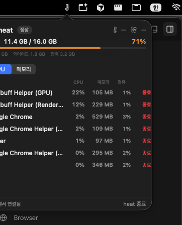

# heat

[](LICENSE)
[](#requirements)

A macOS menu bar app that shows you **why your laptop is hot and why the fans are spinning** — at a glance from the menu bar, with the culprit processes one click away.

<p align="center">
  
</p>

> Ad-hoc signed OSS. Build and run on your own Mac without a paid Apple Developer account or notarization.

## Features

- Menu bar: temperature (°C) or thermal state, `↑` on CPU surge, SF Symbol thermometer
- Popover header: **total memory usage** (used / total · %)
- **CPU / Memory** tabs with a scrollable process list
- Per-process CPU% · RSS memory · share of total
- **Quit** to kill the offending process (SIGTERM after confirmation)
- Detailed sensors (temperature · fans): one-time admin prompt on first launch (the app works fine if declined)

## Requirements

- macOS 14+
- Apple Silicon or Intel Mac
- For local builds: Xcode Command Line Tools (`swiftc`, `xcrun`)

## Install (Release zip)

1. Download `Heat-macos.zip` from [Releases](https://github.com/scs0209/heat/releases)
2. Unzip and move `Heat.app` to `/Applications`
3. Gatekeeper may block the app:

```bash
xattr -dr com.apple.quarantine /Applications/Heat.app
```

Or in Finder: right-click `Heat.app` → **Open**.

4. (Optional) To see detailed temperature and fan data, click **Enable** in the first-launch sheet and enter your admin password once

## Build locally

```bash
git clone https://github.com/scs0209/heat.git
cd heat
./scripts/build-app.sh
open dist/Heat.app
```

Build artifacts:

| Path | Description |
|------|-------------|
| `dist/Heat.app` | ad-hoc signed app |
| `dist/Heat-macos.zip` | zip for distribution |

## Permission model

| Data | Permission |
|------|------------|
| `ProcessInfo.thermalState` | none |
| Top CPU / memory (`ps`) | none |
| System memory (`host_statistics64`) | none |
| CPU temperature · fan RPM (`powermetrics`) | admin once → LaunchDaemon |

Detailed sensor install locations:

- `/usr/local/libexec/heat-sampler`
- `/Library/LaunchDaemons/dev.heat.sampler.plist`
- Samples: `/Users/Shared/heat/sensors.json`

Uninstall:

```bash
sudo launchctl bootout system/dev.heat.sampler 2>/dev/null || true
sudo rm -f /Library/LaunchDaemons/dev.heat.sampler.plist /usr/local/libexec/heat-sampler
rm -rf /Users/Shared/heat
```

## Project layout

```
heat/
  Sources/Heat/     # menu bar app (AppKit + SwiftUI)
  helper/           # privileged heat-sampler
  Resources/        # Info.plist, LaunchDaemon plist
  scripts/          # build-app.sh (ad-hoc codesign + zip)
  docs/             # screenshots
```

## Alternatives

heat is deliberately small and focused. If you need more, these excellent open-source projects cover overlapping ground:

| Project | Menu bar temp/thermal | Culprit process list | Kill from popover | Style |
|---------|:---:|:---:|:---:|-------|
| **heat** | ✅ | ✅ CPU + memory | ✅ | single-purpose, ad-hoc signed |
| [Stats](https://github.com/exelban/stats) | ✅ | ❌ | ❌ | full-featured suite (CPU/GPU/disk/net/sensors) |
| [Hot](https://github.com/macmade/hot) | ✅ | ❌ | ❌ | temperature & throttling only |
| [Eul](https://github.com/gao-sun/eul) | ✅ | ❌ | ❌ | composable SwiftUI widgets |
| [RamGuard](https://github.com/clintoncodewell/ramguard) | ❌ | ⚠️ memory only | ✅ | find & quit RAM hogs |

heat's niche: **"why is my Mac hot — find the culprit and quit it in seconds, straight from the menu bar."**

## Contributing

PRs and issues are welcome. Please read [CONTRIBUTING.md](CONTRIBUTING.md) first.

This project follows the [Contributor Covenant](CODE_OF_CONDUCT.md).

## Out of scope (for now)

- Developer ID / notarization
- Homebrew cask automation
- GPU details, notification rules, history charts

## License

[MIT](LICENSE)
